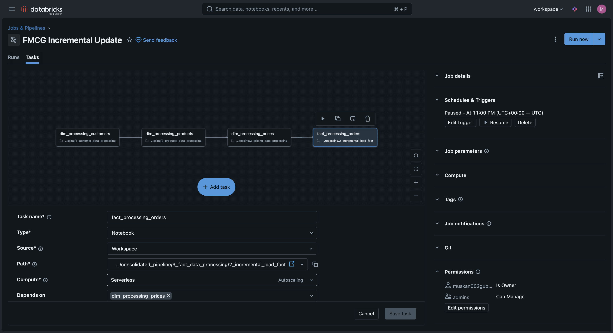
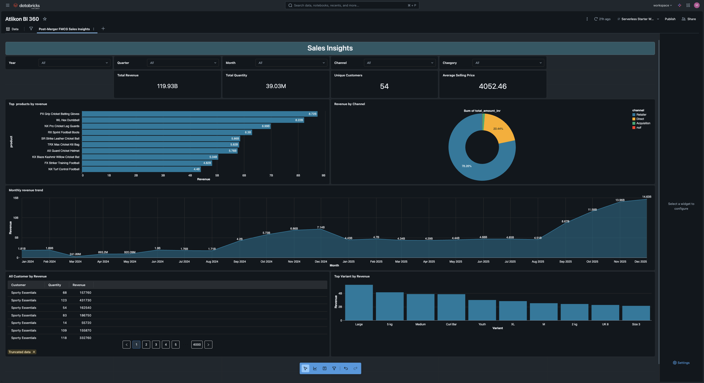

<<<<<<< HEAD
# PIPECRAFT Supply-Chain-Driven Sportswear Data Integration using Databricks

## 📌 Project Overview
This project simulates a **large-scale sportswear company acquisition**, focusing on how enterprise data teams absorb, standardize, and operationalize data from an acquired brand. It delivers a **production-style data engineering platform** that ingests heterogeneous retail, inventory, and supply-chain datasets and transforms them into a single source of truth for business analytics.

The platform is implemented on a **Databricks Lakehouse**, following a **layered Bronze–Silver–Gold architecture** to ensure data quality, auditability, and scalability. It supports **incremental ingestion, schema evolution, automated orchestration, and analytics-ready datasets, enabling downstream BI reporting and decision-making** across the merged organization.

---

## 🏗️ Architecture Overview
The project follows a **Lakehouse architecture** implemented on Databricks, using **Amazon S3 + Delta Lake** for scalable storage and processing.

**Key architectural components:**
- Multi-source ingestion (Parent & Child company data)
- Medallion layers (Bronze, Silver, Gold)
- Delta Lake tables with ACID guarantees
- Unity Catalog for governance
- Databricks Jobs for orchestration
- BI dashboards and Genie for consumption

---

## 🧱 Medallion Architecture

### 🔹 Bronze Layer (Raw Data)
- Raw data ingested from Amazon S3
- Stores structured and semi-structured data as Delta tables
- Supports both **full loads and incremental loads**
- Acts as the immutable source of truth

### 🔹 Silver Layer (Cleansed & Enriched)
- Data cleansing, deduplication, and standardization
- Business logic applied using Spark transformations
- Dimension tables created (customers, products, pricing, dates)
- Ready for analytical joins

### 🔹 Gold Layer (Business-Ready Analytics)
- Aggregated fact tables and denormalized views
- Optimized for BI queries and reporting
- Unified post-merger analytics across both companies
- Directly consumed by dashboards and Genie

---

## 🔄 Data Processing & Orchestration
- Spark-based ETL pipelines built using **PySpark and SQL**
- Separate notebooks for:
  - Dimension processing
  - Fact processing
  - Full and incremental loads
- **Databricks Jobs** used for orchestration
- Tasks executed in dependency order (Dimensions → Facts)
- Pipelines scheduled to run **daily** for incremental updates

---

## 📊 Analytics & BI
- Gold-layer Delta tables power an interactive **Databricks BI dashboard**
- Dashboard provides:
  - Revenue, quantity, and customer KPIs
  - Monthly revenue trends
  - Product and variant performance
  - Channel-wise revenue analysis
- Used to validate data quality and business usability

---

## 🛠️ Tech Stack
- Databricks
- Apache Spark (PySpark)
- Delta Lake
- Amazon S3
- Python
- SQL
- Medallion Architecture
- Databricks Jobs
- Databricks BI & Genie

## 🎯 Key Learnings
- Designing scalable **Lakehouse architectures**
- Implementing **incremental ETL pipelines**
- Applying **Medallion design patterns**
- Orchestrating production pipelines with **Databricks Jobs**
- Building analytics-ready **Gold layers**
- Connecting data engineering outputs to BI consumption

---

## 🚀 Future Enhancements
- Add data quality checks and validations
- Implement Slowly Changing Dimensions (SCD)
- Enable streaming ingestion
- Integrate monitoring and alerting
- Expand analytics use cases

---

## 📌 Conclusion
This project demonstrates a **production-style data engineering workflow** using Databricks — from ingestion and transformation to orchestration and analytics — closely resembling real enterprise FMCG data platforms.

=======
# Databricks_ETL_Project
>>>>>>> 4c2d7c56ae637f4646329e5a31e74c38e68776a9

